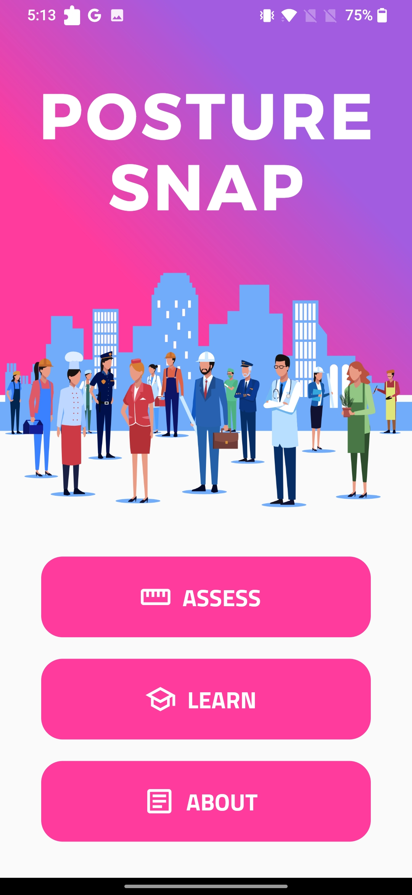
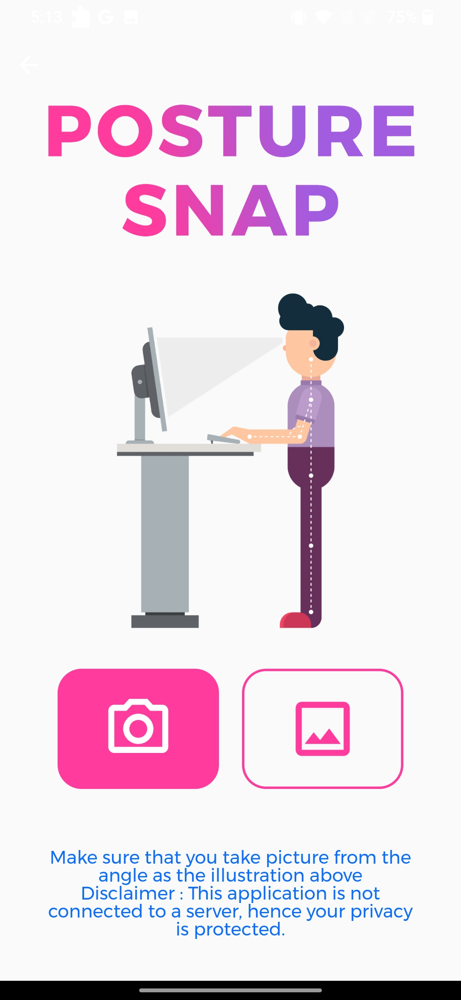
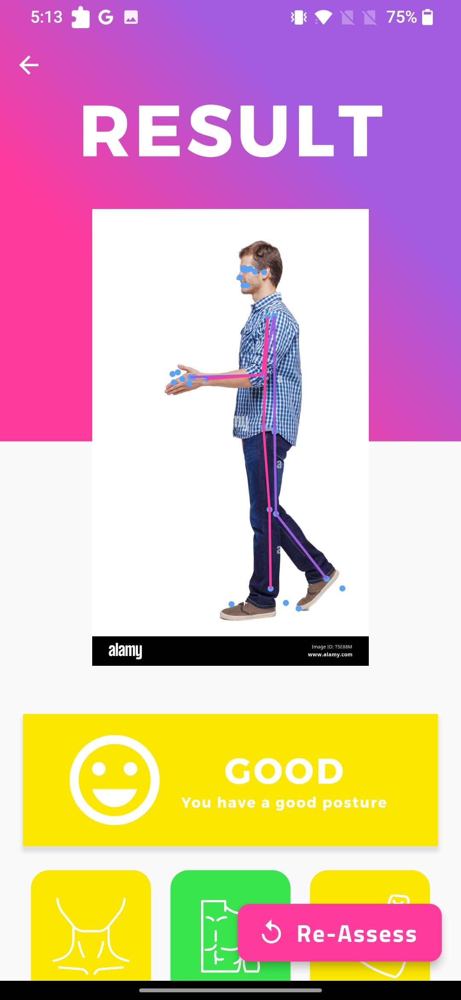
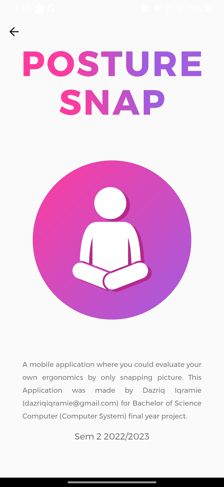
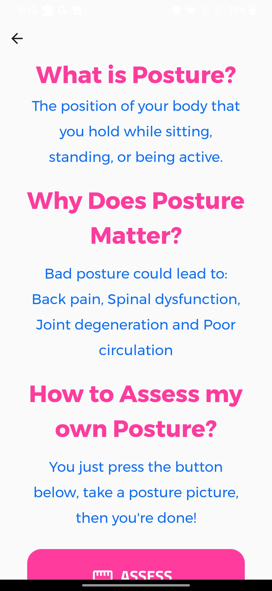

<!-- PROJECT Tittle and description -->

 <h1 align="center">Posture Snap
</h1>
  <h3 align="center">An application where you could assess your own ergonomics by a single click!. This application uses pose estimation and computer vision to determine the joints of a person. After that, it will calculate the angle by using complex mathematics and determine the ergonomic risks of the body using RULA index.</h3>
 <h2>This project was created by Dazriq Iqramie</h2>

# Built With

 

# Preview 

 
 
 
 
 

